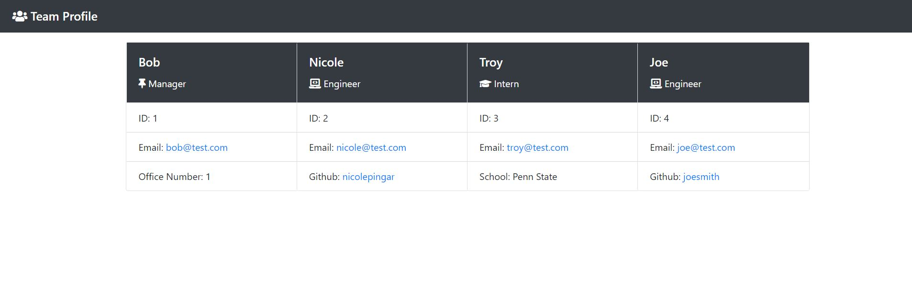

# Team Profile Generator

## Description

I created a team profile generator so employees can enter their associates' information and generate an HTML webpage that displays each associate's information. This project was built using Node.js, JavaScript, HTML, Bootstrap, Font Awesome and Jest. 

## Installation 

Please enter the following to run tests:

        npm i
        npm test

Please enter the following to run the application:

        node index.js

## Usage

Below is a picture of the application. 

Below is a video of the application in use. 

https://drive.google.com/file/d/14t9o0fd29Wu-eKDzYnaASUzQZIol4dGv/view

## Questions 

Please find me on GitHub [nicolepingar](https://github.com/nicolepingar) or email me at nicolepingar@gmail.com.

